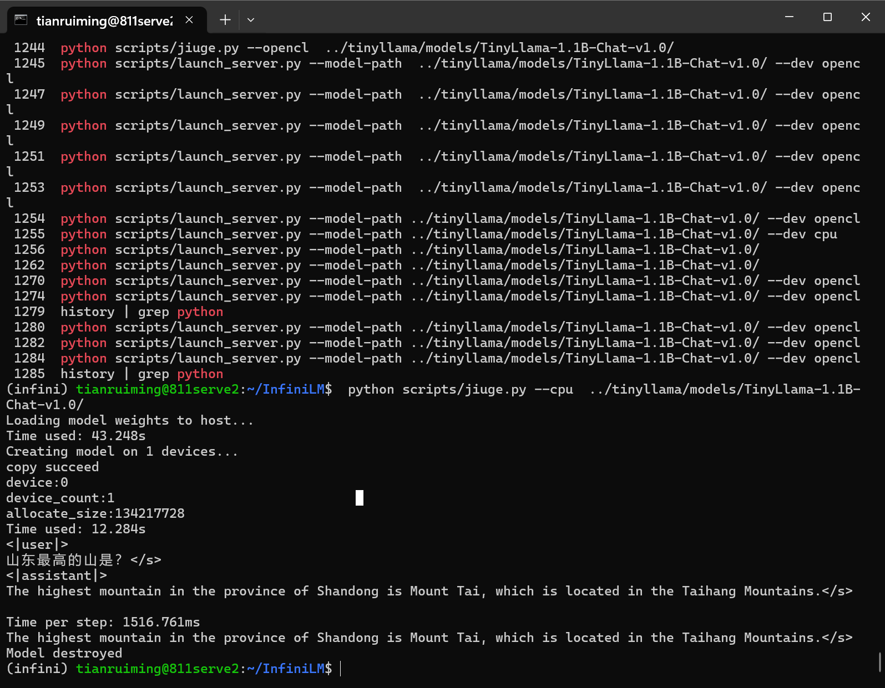
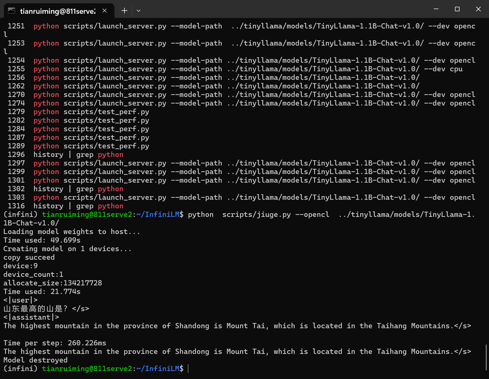
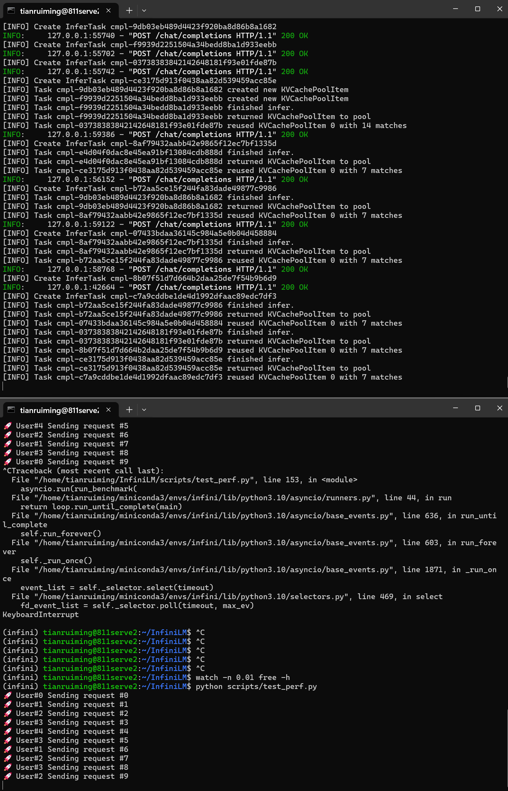

# 完成工作：
* 更新InfiniLM，支持InfiniCore-opencl算子运行，支持opencl后端推理。
* 能够运行tinillama 1.1B
* 测试性能简介：
    CPU 推理性能：Time per step: 1516.761ms
    Opencl 推理性能：Time per step: 260.226ms

* 推理测试截图：

* 推理服务部署与测试截图

备注：[本地环境Opencl平台说明](./clinfo.md)